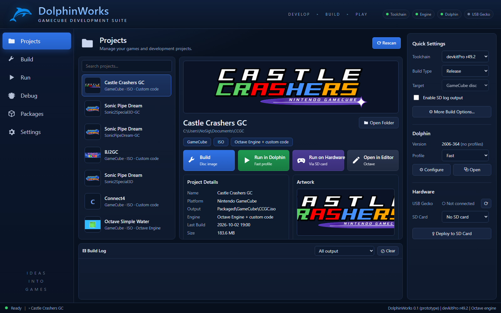

# DolphinWorks

An open-source development suite for Nintendo GameCube

## Components

| Component | Description | Installation |
|---|---|---|
| **[Octave-libogc](https://github.com/myuu-151/Octave-Libogc)** Engine | 3D game engine with a scene editor and Lua scripting. Packages projects as bootable GameCube disc images. | Download the latest release, or build from source with `Build Octave.bat`. |
| **[gekko-toolchain](https://github.com/myuu-151/gekko-toolchain)** Toolchain | Cross-compiler, linker and GameCube libraries: devkitPro's toolchain, distributed as a single archive (unofficial). | Extract the latest release and run `Install.bat`. |
| **[Dolphin](https://dolphin-emu.org)** Emulator | GameCube and Wii emulator for running and debugging builds on PC, with a log window, memory viewer and graphics debugger. | Installed by `dolphinworks.bat`, with a Fast and an Accurate profile. |

## Requirements

| Requirement | Purpose |
|---|---|
| Windows 10 or later | Host platform for the editor, the builders and gekko-toolchain |
| gekko-toolchain, or devkitPro's [`gamecube-dev`](https://devkitpro.org/wiki/Getting_Started) | Building GameCube programs |
| [Python 3](https://www.python.org/downloads/) | Running the builders |
| Python packages: [Pillow](https://pypi.org/project/pillow/) and [numpy](https://pypi.org/project/numpy/) | Making the games' assets (`py -m pip install pillow numpy`) |
| [Visual Studio](https://visualstudio.microsoft.com/) with "Desktop development with C++", and the [Vulkan SDK](https://vulkan.lunarg.com/) | Building the engine from source only |

## Getting started

1. **Run `dolphinworks.bat`.** It installs everything into one folder (`C:\DolphinWorks` by default):
   the Python packages, the toolchain (unless devkitPro or gekko-toolchain is already installed),
   the engine, and Dolphin with two profiles: `Dolphin.bat` for everyday testing and
   `Dolphin (Accurate).bat`, as close to the console as Dolphin goes. If Python isn't installed,
   it offers to install it first.
2. **Build a project:** open the Octave editor from the setup window, create a project and
   package it for GameCube. The output is a disc image (`.iso`).

Run the setup again at any time to update to the latest releases. To install the parts by hand
instead, see each component's repository.

### The DolphinWorks app (prototype)

`app\DolphinWorks.exe` (or `app\DolphinWorks.bat`) opens the development hub: every Octave project on this PC, each with
**Build**, **Run in Dolphin** (Fast or Accurate), **Run on Hardware** (copies the disc image to an
SD card for Swiss) and **Open in Editor**; the toolchain switch and build options; the USB Gecko
and SD cards as they're plugged in; and the build log, live. It needs nothing but Python and
Windows' Edge, and runs in a window of its own.

## Running a build

| Target | Method |
|---|---|
| Emulator | Load the disc image in [Dolphin](https://dolphin-emu.org). |
| Hardware | Copy the disc image to an SD card and launch it with [Swiss](https://github.com/emukidid/swiss-gc). |

## Sources

Forks of the toolchain's components are maintained to keep their sources available.

| Component | Repository |
|---|---|
| libogc | [myuu-151/libogc](https://github.com/myuu-151/libogc) |
| libfat | [myuu-151/libfat](https://github.com/myuu-151/libfat) |
| gamecube-tools | [myuu-151/gamecube-tools](https://github.com/myuu-151/gamecube-tools) |
| devkitPPC rules | [myuu-151/devkitppc-rules](https://github.com/myuu-151/devkitppc-rules) |
| devkitPPC build scripts | [myuu-151/buildscripts](https://github.com/myuu-151/buildscripts) |
| GCC | [myuu-151/gcc](https://github.com/myuu-151/gcc) |
| newlib | [myuu-151/newlib](https://github.com/myuu-151/newlib) |
| GDB and binutils | [myuu-151/binutils-gdb](https://github.com/myuu-151/binutils-gdb) |
| Swiss | [myuu-151/swiss-gc-libogc](https://github.com/myuu-151/swiss-gc-libogc) |
| Dolphin | [myuu-151/dolphin](https://github.com/myuu-151/dolphin), with its build on the release at the exact commit |

---

*DolphinWorks is not affiliated with Nintendo or devkitPro. GameCube is a trademark of Nintendo.*
